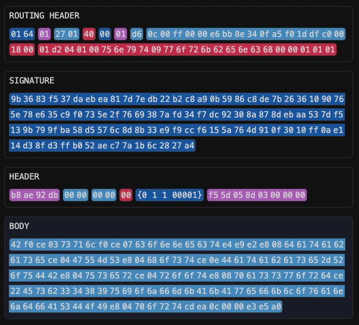

# 8 Structure of a DATEX Block

## 8.1 Overview

A DATEX Block consists of 4 main sections:

- A **Routing Header**, which mainly contains information about the sender and
  receivers of the block, and important information about the block (e.g. block
  size)
- A **Signature**, if the block is signed. Everything after this section (Header
  and Body) is signed by the sender and can also optionally be encrypted
- A **Block Header**, which contains meta data about the current block (type,
  timestamp, id, flags)
- A **Body**, which contains executable DATEX instructions



## 8.2 The Routing Header

The Routing Header is not encrypted or signed, the content always needs to be
parseable by all nodes.

| Name               | Start | End | Size | Content                                               | Description                                                                              |
| ------------------ | :---: | :-: | :--: | ----------------------------------------------------- | ---------------------------------------------------------------------------------------- |
| Magic Number       |   0   |  2  |  2   | 01 64                                                 | Fixed value (0x01 and 'd')                                                               |
| Version Number     |   2   |  3  |  1   | <pre class="language-yaml">VERSION: Uint8&#10;</pre>  | Version number starting from 0x01                                                        |
| Block Size         |   3   |  5  |  2   | <pre class="language-yaml">SIZE: Uint16&#10;</pre>    | Total block size in bytes                                                                |
| TTL                |   5   |  6  |  1   | <pre class="language-yaml">TTL: Uint8&#10;</pre>      | Time-to-live for this block, get decremented with each node redirection                  |
| Priority           |   6   |  7  |  1   | <pre class="language-yaml">PRIORITY: Uint8&#10;</pre> | Routing priority of this block                                                           |
| Signed / Encrypted |   7   |  8  |  1   | <pre class="language-yaml">SECURITY: Uint8&#10;</pre> | 0x00: not signed or encrypted, 0x01: signed, 0x02: encrypted, 0x03: signed and encrypted |

```
DATEX.Endpoint {
	TYPE: Uint8
	ID: Uint8[18]
	INSTANCE: Uint16
}

PointerId {
	TYPE: Uint8
	IDENTIFIER: Uint8[18]
	INSTANCE: Uint16
	TIMESTAMP: Uint32 # unix ts in seconds, starting from 25. Juli 23
	COUNTER: Uint8
}

ReceiverEndpoint {
	ENDPOINT: Endpoint
	optional KEY: Uint8[512] # only if Receivers.FLAGS.ENDPOINTS_HAVE_KEYS
}

ReceiverEndpoints {
	COUNT: Uint16 # if MAX, flood, no RECEIVERS
	ENDPOINTS: ReceiverEndpoint[COUNT]
}

Receivers {
	FLAGS: Uint8
		HAS_POINTER_ID:           FLAGS & 0b00000001,
		HAS_ENDPOINTS:            FLAGS & 0b00000010,
		ENDPOINTS_HAVE_KEYS:      FLAGS & 0b00000100
	optional POINTER_ID: PointerId
	optional ENDPOINTS: ReceiverEndpoints
}

RoutingHeader {
	MAGIC_NUMBER: Uint16 {0x01, 0x64},
	VERSION: Uint8,
	TTL: Uint8,
	FLAGS: Uint8
		HAS_UNENCRYPTED_SIGNATURE: FLAGS & 0b00000001,
		HAS_ENCRYPTION:            FLAGS & 0b00000010,
		HAS_ENCRYPTED_SIGNATURE:   FLAGS & 0b00000100,
		IS_LARGE_SIZE:             FLAGS & 0b00001000
	BLOCK_SIZE: IS_LARGE_SIZE ? Uint32 : Uint16,

	SCOPE_ID: Uint32
	BLOCK_INDEX: Uint16
	BLOCK_SUB_INDEX: Uint16

	SENDER_TYPE: Uint8,
	optional SENDER: Uint8[20] # only exists if SENDER_TYPE != 255, otherwise SENDER is @@any
	optional RECEIVERS: Receivers
}

BlockHeader {
	
	FLAGS: Uint21
		BLOCK_TYPE:    FLAGS & 0b111100000000000000000,
		ALLOW_EXECUTE: FLAGS & 0b000010000000000000000,
		END_OF_BLOCK:  FLAGS & 0b000001000000000000000, # if a subdivided block has only a single signature, it is sent with the last block containing the END_OF_BLOCK flag
		END_OF_SCOPE:  FLAGS & 0b000000100000000000000,
		HAS_EXPIRATION_TIMESTAMP:   FLAGS & 0b000000010000000000000,
		HAS_ON_BEHALF_OF:           FLAGS & 0b000000001000000000000,
		HAS_REPRESENTED_BY:         FLAGS & 0b000000000100000000000,
		IS_COMPRESSED:              FLAGS & 0b000000000010000000000,
		_RESERVED_:    FLAGS & 0b000000000001111111111,
	CREATION_TIMESTAMP: Uint43, # unix ts in ms, starting from 25. Juli 23
	optional EXPIRATION_OFFSET: Uint32, # unix ts in seconds, starting from CREATION_TIMESTAMP
	optional REPRESENTED_BY: Endpoint
	optional IV: Uint8[16]
}

DXB {
	ROUTING_HEADER: RoutingHeader,
	optional UNENCRYPTED_SIGNATURE: Uint8[192],
	optional ENCRYPTED_SIGNATURE: Uint[x] # used instead SIGNATURE to hide identity of signing endpoint (when using ON_BEHALF_OF)
	# optional start signed part:
	optional BLOCK_HEADER: BlockHeader
	# optional start encrypted part:
	ENCRYPTED_FLAGS: Uint8
		DEVICE_TYPE: ENCRYPTED_FLAGS & 0b11110000
	optional ON_BEHALF_OF: Endpoint,
	BODY: DXBBody
}
```

## 8.3 The Block Header

The Block Header is part of the signed and encrypted part. If the block is
signed, the header cannot be altered, and it can't be read by non-receiving
parties if the block is encrypted.

| Name              | Start | End | Size | Content                                                   | Description                                                        |
| ----------------- | :---: | :-: | :--: | --------------------------------------------------------- | ------------------------------------------------------------------ |
| Scope ID          |   0   |  4  |  4   | <pre class="language-yaml">SID: Uint32&#10;</pre>         | Scope ID, unique for a certain sender for a certain period of time |
| Scope Block Index |   4   |  6  |  2   | <pre class="language-yaml">BLOCK_INDEX: Uint16&#10;</pre> | Index of the block within the current scope                        |
| Scope Block Inc   |   6   |  8  |  2   | <pre class="language-yaml">SIZE: Uint16&#10;</pre>        | Incremented for each block of a scope                              |
| Type              |   8   |  9  |  1   | <pre class="language-yaml">TYPE: Uint8&#10;</pre>         | Block type. See _Block Types_                                      |
| Flags             |   9   | 10  |  1   | <pre class="language-yaml">FLAGS: Uint8&#10;</pre>        | executable, end of scope, device type                              |
| Timestamp         |  10   | 18  |  8   | <pre class="language-yaml">TIME: Uint64&#10;</pre>        | Time in ms since 2022-01-22 (to be changed)                        |
